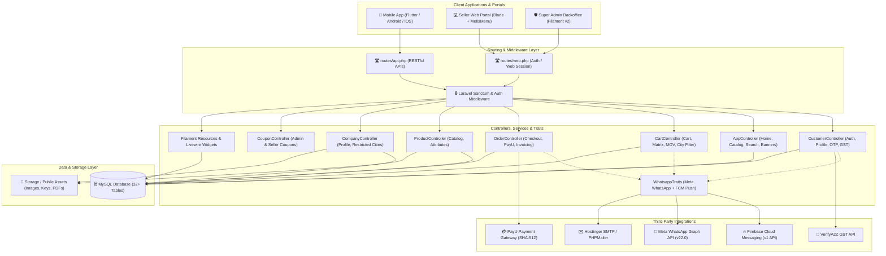
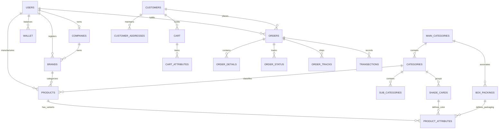
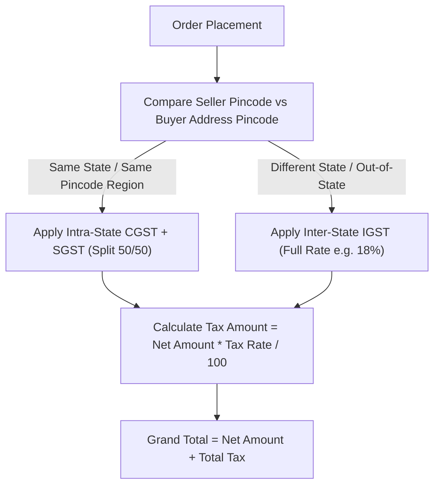
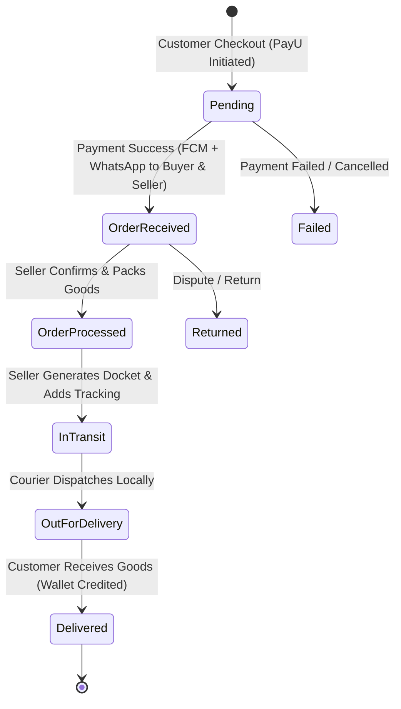

# 🏭 ApniFactory — Complete Architecture & Technical Documentation

> **Comprehensive System Specification, Architectural Design, Database Schemas, API Reference, and Integration Guide**

---

## 📑 Table of Contents

1. [Executive Overview](#1-executive-overview)
2. [High-Level System Architecture](#2-high-level-system-architecture)
3. [User Roles & Access Control](#3-user-roles--access-control)
4. [Domain Model & Database Design](#4-domain-model--database-design)
5. [Core Business Logic & Workflows](#5-core-business-logic--workflows)
   - [Product & Attribute Matrix (Box Packaging × Shade Card)](#product--attribute-matrix)
   - [Single-Seller Cart Enforcement](#single-seller-cart-enforcement)
   - [Taxation & GST Calculation (CGST/SGST vs IGST)](#taxation--gst-calculation)
   - [Dual-Tier Coupon Engine](#dual-tier-coupon-engine)
   - [Order Lifecycle & Tracking](#order-lifecycle--tracking)
   - [Wallet, Commission & Credit Notes](#wallet-commission--credit-notes)
   - [Location & Restricted Cities Engine](#location--restricted-cities-engine)
6. [API Specification & Endpoints](#6-api-specification--endpoints)
7. [External Services & Integrations](#7-external-services--integrations)
   - [Firebase Cloud Messaging (FCM v1)](#firebase-cloud-messaging-fcm-v1)
   - [Meta / WhatsApp Business Graph API](#meta--whatsapp-business-graph-api)
   - [GST Verification (VerifyA2Z API)](#gst-verification-verifya2z-api)
   - [Payment Gateway (PayU / MihPay SHA-512 Hash)](#payment-gateway)
   - [Transactional Email (PHPMailer / SMTP)](#transactional-email)
8. [Codebase Directory Structure](#8-codebase-directory-structure)
9. [Installation, Setup & Environment Guide](#9-installation-setup--environment-guide)
10. [Security, Performance & Best Practices](#10-security-performance--best-practices)

---

## 1. Executive Overview

**ApniFactory** is a multi-tier B2B/B2C manufacturing and wholesale supply chain e-commerce platform built on **Laravel 8**, **Filament Admin Panel**, and **RESTful Mobile APIs**.

The platform bridges factory manufacturers (sellers) directly with wholesale retailers and buyers (customers) across India. It solves complex manufacturing commerce challenges, such as:

- **Matrix-based pricing:** Calculating variant prices by combining box packing sizes (e.g., 6 pcs, 12 pcs, 24 pcs) with color shade cards (swatches with hex codes).
- **Minimum Order Value (MOV):** Factory-specific minimum order thresholds.
- **Location-based delivery restrictions:** Seller-defined delivery coverage down to specific Indian cities and pincodes.
- **Automated multi-channel notifications:** Instant WhatsApp updates and push notifications via FCM on order milestones.
- **GST Compliance:** Automated business GST verification and state-level tax calculation (Intra-state CGST+SGST vs Inter-state IGST).
- **Commission & Escrow Wallet:** Automatic platform commission deduction and credit note generation for seller payouts.

---

## 2. High-Level System Architecture



---

## 3. User Roles & Access Control

| Role | Access Interface | Authentication | Primary Capabilities |
| :--- | :--- | :--- | :--- |
| **Super Admin** | Filament Panel (`/admin` or `/panel`) | `admins` guard / Web Session | Master catalog approval, user verification, commission settings, wallet debit/credit adjustments, global coupons, global ads/sliders, disputes & ticket management. |
| **Seller / Factory Owner** | Web Portal (`/seller/*`) | `users` guard (Session Auth) | Company profile & GST registration, Brand registration, Product creation with Shade × Box attribute matrix, order fulfilment, dispatch tracking, city delivery restrictions, credit notes. |
| **Customer / Buyer** | Mobile Application (Android/iOS) | Mobile API (Token / Sanctum / Device ID) | Catalog discovery by Company/Category/Brand/Shade, matrix cart management, coupon redemption, GST verification, online checkout (PayU), order tracking, reviews. |

---

## 4. Domain Model & Database Design

### Entity Relationship Diagram



### Key Database Tables

| Table Name | Purpose & Key Columns |
| :--- | :--- |
| `users` | Factory seller accounts (`id`, `name`, `email`, `password`, `created_at`). |
| `admins` | Platform super administrators (`id`, `name`, `email`, `role`, `service`, `password`). |
| `customers` | Retail buyers & customers (`id`, `name`, `email`, `mobile`, `firebaseid`, `gstorpan`, `location`, `status`). |
| `companies` | Seller company profiles (`id`, `user_id`, `name`, `gst`, `crn`, `minordervalue`, `city`, `state`, `pincode`, `comission`, `restricted_city`). |
| `brands` | Brands registered under companies (`id`, `company_id`, `category_id`, `user_id`, `name`, `trademarkno`, `status`). |
| `main_categories` | Top-level industrial categories (`id`, `name`, `title`, `image`, `sequence`, `status`). |
| `categories` | Sub-divisions under main categories (`id`, `maincategory_id`, `name`, `image`, `sequence`, `status`). |
| `shade_cards` | Color swatches with hex codes (`id`, `name`, `hexcode`, `category_id`, `maincategory_id`, `status`). |
| `box_packings` | Packaging quantities & units (`id`, `name`, `pcs`, `maincategory_id`, `status`). |
| `products` | Master product catalog (`id`, `product_id`, `maincategory_id`, `category_id`, `brand_id`, `user_id`, `name`, `slug`, `hsncode`, `tax`, `image`, `multipleimages`). |
| `product_attributes` | Variant matrix rows (`id`, `product_id`, `color` [shade_cards id], `quantity` [box_packings id], `price`, `oldprice`). |
| `cart` & `cartattribute` | Active customer cart sessions, attribute configurations, applied coupons, and target seller. |
| `orders` | Placed order headers (`id`, `orderno`, `customer_id`, `user_id`, `netamount`, `taxamount`, `taxdetail`, `grandtotal`, `sellercouponamount`, `admincouponamount`). |
| `orderdetail` | Snapshot of purchased items, variants, packaging, HSN codes, and applied discounts. |
| `order_status` | Status progression logs (`pending`, `Order Received`, `Order Processed`, `In Transit`, `Out for Delivery`, `Delivered`, `Returned`). |
| `order_tracks` | Shipment tracking information (`order_id`, `courier_name`, `tracking_no`, `tracking_url`). |
| `transections` | Payment gateway transaction details, MihPay IDs, PG status, and payloads. |
| `wallet` | Seller ledger & escrow (`user_id`, `order_id`, `orderno`, `value`, `commission`, `debit`, `credit`, `balance`, `msg`). |
| `coupons` | Promo codes with min orders, max discounts, seller-specific or global admin rules. |
| `customer_addresses` | Buyer shipping & delivery addresses with city, state, and pincode. |
| `india_pincode` | Master directory of Indian states, cities, and pincodes for validation and delivery rules. |
| `notifications` | In-app customer notification history with read/unread tracking. |
| `tickets` & `bank_details` | Seller support tickets and bank payout account details. |

---

## 5. Core Business Logic & Workflows

### Product & Attribute Matrix

In manufacturing, items (e.g., garments, hardware, plastic goods) are ordered by unit packagings and colors. The platform provides a dynamic matrix interface:

$$\text{Unit Price} = \text{Price per piece} \times \text{Pieces in Box Packing}$$
$$\text{Line Item Total} = \text{Unit Price} \times \text{Order Quantity}$$

```
                ┌────────────────────────────────────────────────┐
                │          Box Packaging (e.g., 12 Pcs)          │
┌───────────────┼────────────────────────────────────────────────┤
│ Shade Card    │ Price: ₹50/pc -> Box: ₹600                     │
│ (e.g. Red)    │ Qty: [ 5 Boxes ] -> Subtotal: ₹3,000           │
└───────────────┴────────────────────────────────────────────────┘
```

### Single-Seller Cart Enforcement

To simplify supply-chain logistics and factory direct shipping:
- A customer cannot add products from two different manufacturers/companies in the same cart.
- `CartController::checkcartconditions()` enforces that if an existing cart contains products from Seller A, adding a product from Seller B is rejected until the previous cart is cleared.

### Taxation & GST Calculation

The system dynamically determines tax classification based on seller vs buyer locations:



### Dual-Tier Coupon Engine

1. **Seller Coupons:** Configured by individual factory sellers applying to their specific inventory.
2. **Admin Global Coupons:** Platform-wide promotions sponsored by ApniFactory administrators.
3. Both discounts are itemized separately in `orders` (`sellercouponamount`, `admincouponamount`) for accurate seller settlements and wallet calculations.

### Order Lifecycle & Tracking



### Wallet, Commission & Credit Notes

- **Commission Deductions:** When an order completes, the platform computes the platform fee (`comission` % configured on the seller company).
- **Wallet Entries:** Net revenue is credited to the seller's wallet ledger; refunds and fees are debited.
- **Credit Notes:** Automated credit note invoices generated via Blade/mPDF for formal accounting.

### Location & Restricted Cities Engine

- Sellers can disable fulfillment to specific cities via `/seller/citynotallow`.
- During cart addition and checkout, `CartController::checkavailability()` validates the buyer's shipping city against `restricted_city` JSON array.

---

## 6. API Specification & Endpoints

All mobile API routes are registered in [`routes/api.php`](file:///e:/APNI%20FACTORY/ApniFactory%20Application/routes/api.php) with JSON responses.

### 🔐 Authentication & Profile

| Method | Endpoint | Description | Request Parameters |
| :--- | :--- | :--- | :--- |
| `POST` | `/api/register` | Register new customer account | `name`, `email`, `mobile`, `password`, `regby` |
| `POST` | `/api/login` | Authenticate customer | `email` (or mobile), `password`, `deviceid` |
| `POST` | `/api/sendotp` | Generate and send OTP via WhatsApp or Email | `emailmobile`, `sendon` (`'mobile'` or `'email'`) |
| `POST` | `/api/verifyotp` | Verify received OTP code | `emailmobile`, `otp` |
| `POST` | `/api/resetpassword` | Reset password after OTP verification | `emailmobile`, `password` |
| `GET` | `/api/viewprofile/{id}` | Fetch customer profile data | Route param: customer `id` |
| `POST` | `/api/updateprofile/{id}` | Update profile information and avatar | `name`, `mobile`, `email`, `location`, `whatsappno`, `gstorpan`, `image` (file) |
| `POST` | `/api/changepassword/{id}` | Change user password | `currentpassword`, `newpassword` |
| `GET` | `/api/gstverification` | Validate buyer GST number in real time | `gst` (e.g. `07AAAAA0000A1Z5`) |

### 🛍️ Catalog, Home & Discovery

| Method | Endpoint | Description | Request Parameters |
| :--- | :--- | :--- | :--- |
| `GET` | `/api/homescreen` | Main landing data: sliders, main categories, banners, unread notifications count | `userid` |
| `GET` | `/api/categoryscreen` | Categories and companies under a main category | `mid` (Main Category ID) |
| `GET` | `/api/companyscreen` | Companies offering products in a specific category | `cid` (Category ID) |
| `GET` | `/api/brandscreen` | Brands under a company and category | `cmpid` (Company ID), `cid` (Category ID) |
| `GET` | `/api/productlist` | Product catalog for a brand and category with minimum prices & shades | `bid` (Brand ID), `cid` (Category ID) |
| `POST` | `/api/productdetail` | Comprehensive product details, gallery, attributes, and reviews | `productid` |
| `POST` | `/api/productattributeprice` | Dynamic price calculation for selected packaging and color | `productid`, `colorid`, `boxid` |
| `GET` | `/api/seller/paint-families/{id}/pricing` | Retrieve complete Paint Family SKU matrix, seller base prices & customer prices | Route param `id` (Product ID) |
| `POST` | `/api/seller/paint-pricing/preview` | Preview proposed bulk price adjustments (+₹/L, +%, +₹) before saving | `product_id`, `adjustment_type`, `adjustment_value`, `scope_type`, `shades`, `packings` |
| `POST` | `/api/seller/paint-pricing/apply` | Atomically apply confirmed bulk price adjustment with audit logging | `product_id`, `adjustment_type`, `adjustment_value`, `scope_type`, `shades`, `packings` |
| `POST` | `/api/seller/paint-pricing/sku-override` | Direct single-SKU factory price or customer price manual override | `sku_id`, `seller_price` or `price` |
| `GET` | `/api/seller/paint-pricing/audit/{id}` | History of price revisions and audit logs for a product family | Route param `id` (Product ID) |
| `POST` | `/api/search` | Universal search across categories, companies, products, and shade cards | `word` |
| `POST` | `/api/branddetail` | Brand info and parent company data | `brandid` |

### 🛒 Cart & Wishlist

| Method | Endpoint | Description | Request Parameters |
| :--- | :--- | :--- | :--- |
| `POST` | `/api/addtocart` | Add variant matrix items to cart (enforces single-seller rule) | `productid`, `userid`, `brandid`, `attributes` (`[{id, qty}]`) |
| `POST` | `/api/usercart` | Retrieve current cart items, attribute breakdowns, taxes, and grand totals | `userid` |
| `POST` | `/api/increasecartqty` | Update quantity of a specific cart attribute item | `cartattributeid`, `qty` |
| `POST` | `/api/deletecartattribute`| Remove a single variant item from cart | `cartattributeid` |
| `POST` | `/api/emptycart` | Clear entire cart for a user | `userid` |
| `POST` | `/api/updatecartaddress` | Assign delivery address to cart | `userid`, `addressid` |
| `POST` | `/api/checkavailability` | Check if selected seller delivers to customer's address city | `userid`, `addressid` |
| `POST` | `/api/relatedproductincart`| Get recommendation products based on cart category | `userid` |
| `POST` | `/api/addtowishlist` | Save product to wishlist | `userid`, `productid` |
| `POST` | `/api/userwishlist` | Retrieve customer wishlist | `userid` |
| `POST` | `/api/deletewishlist` | Remove item from wishlist | `id` |

### 📍 Addresses & Coupons

| Method | Endpoint | Description | Request Parameters |
| :--- | :--- | :--- | :--- |
| `POST` | `/api/address` | List all saved addresses for a customer | `userid` |
| `POST` | `/api/addaddress` | Add a new delivery address | `userid`, `name`, `mobile`, `address`, `city`, `state`, `pincode`, `landmark` |
| `POST` | `/api/address/{id}` | Update existing address | Route param `id`, address fields |
| `DELETE`| `/api/address/{id}` | Delete saved address | Route param `id` |
| `GET` | `/api/statecitypincode` | Fetch master Indian states/cities/pincodes directory | Optional filters |
| `POST` | `/api/couponlist` | Available coupons for cart | `userid`, `cartid` |
| `POST` | `/api/applycoupon` | Apply promo code to cart | `userid`, `couponcode` |

### 📦 Orders & Payments

| Method | Endpoint | Description | Request Parameters |
| :--- | :--- | :--- | :--- |
| `POST` | `/api/order` | Place order, compute taxes, validate MOV, and generate PayU SHA-512 payment hash | `userid`, `addressid` |
| `POST` | `/api/order/transection/success` | Payment gateway success webhook / callback | PayU payload (`txnid`, `mihpayid`, `status`, `udf3`, etc.) |
| `POST` | `/api/order/transection/failed` | Payment gateway failure webhook / callback | PayU payload (`txnid`, `mihpayid`, `status`, error info) |
| `POST` | `/api/orderhistory` | List customer order history with status and tracking | `userid` |
| `POST` | `/api/orderdetail` | Deep inspection of an order including status timeline and courier track | `orderno` |
| `POST` | `/api/orderstatus` | Order status progression history | `orderid` |

### 🔔 Notifications & Static Content

| Method | Endpoint | Description | Request Parameters |
| :--- | :--- | :--- | :--- |
| `GET` | `/api/notification` | Fetch in-app notifications | `userid` |
| `POST` | `/api/setreadnotification` | Mark notification as read | `notificationid` |
| `GET` | `/api/faq` | FAQs list | — |
| `POST` | `/api/feedback` | Submit feedback | `userid`, `message`, `rating` |
| `GET` | `/api/pages/{name}` | Dynamic CMS page content (Privacy, Terms, About) | Route param `name` (slug) |
| `GET` | `/api/helpnoforapp` | Support helpline and WhatsApp number | — |

---

## 7. External Services & Integrations

### Firebase Cloud Messaging (FCM v1)

- **Implementation:** [`app/Traits/WhatsappTraits.php`](file:///e:/APNI%20FACTORY/ApniFactory%20Application/app/Traits/WhatsappTraits.php) using Google API Client (`Google\Client`) and OAuth2 Service Account assertion (`storage/app/keysfirebase.json`).
- **Scope:** `https://www.googleapis.com/auth/firebase.messaging`
- **Features:** High-priority Android notification payloads with `FLUTTER_NOTIFICATION_CLICK` action, custom data routing (`screen`, `screenid`), and batch broadcast to multi-device tokens (`sendnotificationfcm_multipledevices`).

### Meta / WhatsApp Business Graph API

- **Endpoint:** `https://graph.facebook.com/v22.0/{PHONE_NUMBER_ID}/messages`
- **Templates Utilized:**
  - `app_otp_verification`: One-Time Password with button authentication payload.
  - `order_confirm`: Confirmation sent to buyer with Order ID and Customer Name.
  - `order_received`: Factory alert sent to seller on new purchase.
  - `order_status`: Milestone updates with Order No, Status, Date, and Tracking Notes.

### GST Verification (VerifyA2Z API)

- **Endpoint:** `https://api.verifya2z.com/api/v1/verification/gst_verify`
- **Mechanism:** JWT authentication payload signed with `HS256`, verifying GSTIN active filing status and legal entity name upon seller onboarding or buyer profile verification.

### Payment Gateway (PayU)

- **Hash Algorithm:** SHA-512 parameter concatenation:
  $$\text{Hash} = \text{SHA-512}(Key \mid TxnID \mid Amount \mid ProductInfo \mid FirstName \mid Email \mid UDF1 \mid UDF2 \mid UDF3 \mid UDF4 \mid UDF5 \mid \dots \mid Salt)$$
- **Callbacks:** Automated status synchronization with cart clearance on verified transactions.

### Transactional Email

- **Library:** PHPMailer via Hostinger SMTP (`verify@apnifactory.co.in`, Port 465 SSL/SMTPS) for transactional OTP verification and HTML invoice delivery.

---

## 8. Codebase Directory Structure

```
ApniFactory Application/
├── app/
│   ├── Console/              # Artisan commands & scheduled tasks
│   ├── Exceptions/           # Exception handler & reporting
│   ├── Filament/             # Super Admin Backoffice
│   │   ├── Resources/        # Filament resources (Products, Orders, Companies, etc.)
│   │   └── Widgets/          # Dashboard metrics (UsersChart, MyCounterWidget)
│   ├── Helper/
│   │   └── helper.php        # Global utility functions (tax, attributes, catalog helpers)
│   ├── Http/
│   │   ├── Controllers/      # Application controllers (API, Web, Auth, Filament)
│   │   └── Middleware/       # Authentication, CORS, Sanctum middleware
│   ├── Models/               # 30+ Eloquent models representing domain entities
│   ├── Providers/            # Service providers (Route, Auth, App, Event)
│   └── Traits/
│       └── WhatsappTraits.php# Central integration trait for FCM & WhatsApp APIs
├── config/                   # Laravel & package configurations (app, auth, filament, etc.)
├── database/
│   ├── factories/            # Model factories for testing
│   ├── migrations/           # 32 database migration files
│   └── seeders/              # Database seeders
├── public/                   # Publicly accessible assets (CSS, JS, images, mailer, mpdf)
├── resources/
│   ├── css/ & js/            # Frontend assets & scripts
│   └── views/                # Blade template hierarchy
│       ├── auth/             # Login, register, password reset views
│       ├── filament/         # Custom Filament views & overrides
│       ├── order/            # Seller order management & invoice templates
│       ├── product/          # Product creation & matrix variant forms
│       ├── seller/           # Seller portal views (dashboard, brand, profile, wallet)
│       └── sidebar.blade.php # Seller navigation sidebar
├── routes/
│   ├── api.php               # RESTful API routes for Mobile App
│   ├── web.php               # Web routes for Seller Portal & Super Admin
│   ├── channels.php          # Broadcasting channels
│   └── console.php           # Console command closures
├── storage/                  # Logs, framework cache, and uploaded files
├── tests/                    # Feature and Unit test suites
├── composer.json             # PHP dependencies (Laravel 8, Filament 2, Google API Client)
├── package.json              # NPM frontend dependencies & build scripts
└── webpack.mix.js            # Laravel Mix asset compilation config
```

---

## 9. Installation, Setup & Environment Guide

### System Prerequisites

- **PHP:** `^7.4` or `^8.0` (with extensions: `pdo_mysql`, `mbstring`, `openssl`, `curl`, `gd`, `fileinfo`, `xml`)
- **Composer:** `^2.0`
- **Node.js & NPM:** Node 16+ / NPM 8+
- **Database:** MySQL 5.7+ or MariaDB 10.3+

### Step-by-Step Setup

1. **Clone the repository:**
   ```bash
   git clone <repository_url> "ApniFactory Application"
   cd "ApniFactory Application"
   ```

2. **Install PHP Dependencies:**
   ```bash
   composer install --optimize-autoloader
   ```

3. **Install JavaScript Dependencies:**
   ```bash
   npm install
   npm run dev
   ```

4. **Configure Environment Variables:**
   ```bash
   cp .env.example .env
   php artisan key:generate
   ```

5. **Update `.env` Database & Service Credentials:**
   ```ini
   APP_NAME="ApniFactory"
   APP_ENV=local
   APP_KEY=base64:...
   APP_DEBUG=true
   APP_URL=http://localhost:8000

   DB_CONNECTION=mysql
   DB_HOST=127.0.0.1
   DB_PORT=3306
   DB_DATABASE=apnifactory_db
   DB_USERNAME=root
   DB_PASSWORD=your_password

   # Mailer Config
   MAIL_MAILER=smtp
   MAIL_HOST=smtp.hostinger.com
   MAIL_PORT=465
   MAIL_USERNAME=verify@apnifactory.co.in
   MAIL_PASSWORD="your_smtp_password"
   MAIL_ENCRYPTION=ssl
   MAIL_FROM_ADDRESS=verify@apnifactory.co.in
   MAIL_FROM_NAME="ApniFactory"
   ```

6. **Place Firebase Service Account JSON:**
   Ensure `keysfirebase.json` is located at `storage/app/keysfirebase.json`.

7. **Run Database Migrations & Seeders:**
   ```bash
   php artisan migrate
   php artisan db:seed
   ```

8. **Link Storage & Start Local Server:**
   ```bash
   php artisan storage:link
   php artisan serve
   ```
   - Access **Seller Portal:** `http://localhost:8000/seller/login`
   - Access **Admin Panel:** `http://localhost:8000/admin` or via Filament route

---

## 10. Security, Performance & Best Practices

1. **API Token Security:** Authenticated customer endpoints should be guarded via Laravel Sanctum bearer tokens.
2. **Payment Hash Verification:** Validate response hash received from payment gateway webhooks prior to marking orders as paid.
3. **Environment Secrets:** Move API tokens, WhatsApp bearer keys, and JWT secrets currently in controller traits into `.env` and `config/services.php`.
4. **Optimized Queries:** Utilize Eloquent eager loading (`with()`) on catalog queries to prevent N+1 query bottlenecks on large product attribute listings.
5. **Storage Management:** Keep uploaded product media organized by directory structure using the `public` disk and CDN distribution in production.

---

*Document compiled for the ApniFactory Engineering & Development Team.*
